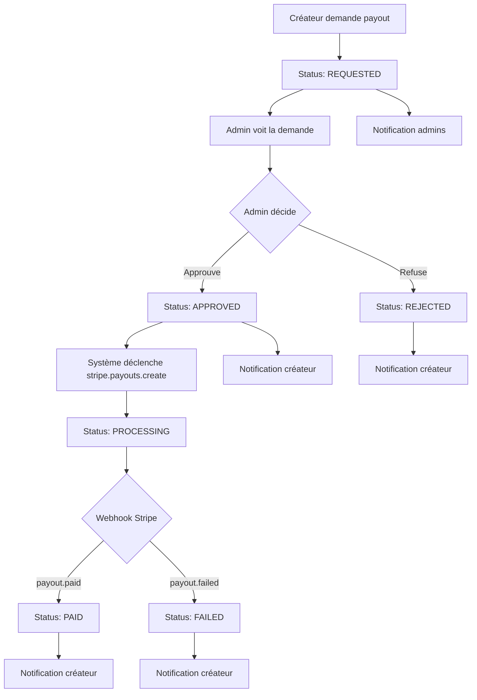

# Phase 3 - Créer l'entité Payout métier - TERMINÉ ✅

**Date:** 27 décembre 2025  
**Branche:** `feature/stripe-payout-automation`  
**Commit:** `8677ffc - ✅ Phase 3: Créer l'entité Payout métier complète`

---

## 📋 Objectif

Créer une vraie entité Payout métier avec des statuts clairs pour remplacer l'utilisation de PayoutAuditLog comme entité principale.

**Workflow attendu:**
```
Créateur demande → REQUESTED
     ↓
Admin approuve → APPROVED
     ↓
Système déclenche stripe.payouts.create() → PROCESSING
     ↓
Webhook payout.paid → PAID
     OU
Webhook payout.failed → FAILED
     OU
Admin refuse → REJECTED
```

---

## ✅ Réalisations

### 1. Modèle Prisma - Payout

**Avant (PayoutStatus complexe):**
```prisma
enum PayoutStatus {
  PENDING           // Initial state, awaiting payment
  HELD              // Payment succeeded, funds held for 7 days
  READY             // Holding period passed, ready for transfer
  PENDING_APPROVAL  // Awaiting admin approval
  APPROVED          // Approved by admin, ready for Stripe processing
  REJECTED          // Rejected by admin
  PROCESSING        // Transfer in progress
  PAID              // Successfully transferred to creator
  FAILED            // Transfer failed
  CANCELLED         // Cancelled (refund/dispute)
}
```

**Après (PayoutStatus simplifié):**
```prisma
enum PayoutStatus {
  REQUESTED   // Demande créée par le créateur
  APPROVED    // Approuvée par l'admin
  PROCESSING  // Payout Stripe en cours
  PAID        // Payout réussi
  FAILED      // Payout échoué
  REJECTED    // Refusée par l'admin
  CANCELED    // Annulée
}
```

**Modèle Payout mis à jour:**
```prisma
model Payout {
  id              String       @id @default(cuid())
  creatorId       String
  amount          Decimal      @db.Decimal(10, 2)
  currency        String       @default("EUR")
  status          PayoutStatus @default(REQUESTED)
  
  // Stripe
  stripePayoutId  String?      @unique
  
  // Dates
  requestedAt     DateTime     @default(now())
  approvedAt      DateTime?
  paidAt          DateTime?
  failedAt        DateTime?
  rejectedAt      DateTime?
  
  // Relations
  approvedById    String?
  approvedBy      User?        @relation("PayoutApprovedBy", fields: [approvedById], references: [id])
  
  // Raisons
  rejectionReason String?      @db.Text
  failureReason   String?      @db.Text
  
  // Metadata
  metadata        Json?
  
  // Audit
  createdAt       DateTime     @default(now())
  updatedAt       DateTime     @updatedAt
  
  // Relations
  creator         Creator          @relation(fields: [creatorId], references: [id], onDelete: Cascade)
  auditLogs       PayoutAuditLog[]
  transactionLogs TransactionLog[] @relation("PayoutLogs")

  @@index([creatorId])
  @@index([status])
  @@index([currency])
  @@index([stripePayoutId])
}
```

**Modèle PayoutAuditLog mis à jour:**
```prisma
model PayoutAuditLog {
  id               String        @id @default(cuid())
  creatorId        String
  payoutId         String?       // ✅ NOUVEAU: Reference to the Payout entity
  action           PayoutAction
  amount           Decimal?      @db.Decimal(10, 2)
  status           PayoutStatus?
  stripePayoutId   String?
  adminId          String?
  reason           String?       @db.Text
  metadata         String?       @db.Text
  createdAt        DateTime      @default(now())
  updatedAt        DateTime      @updatedAt

  // Relations
  creator Creator @relation(fields: [creatorId], references: [id], onDelete: Cascade)
  payout  Payout? @relation(fields: [payoutId], references: [id], onDelete: Cascade)

  @@index([creatorId])
  @@index([payoutId])  // ✅ NOUVEAU
  @@index([action])
  @@index([createdAt])
}
```

**Modèle User mis à jour:**
```prisma
model User {
  // ... autres champs
  payoutsApproved Payout[]     @relation("PayoutApprovedBy")  // ✅ NOUVEAU
}
```

---

### 2. Migration Prisma

**Migration:** `20251227112756_phase3_payout_entity_refactor`

**Changements:**
- ✅ Simplifié l'enum `PayoutStatus` (7 statuts au lieu de 10)
- ✅ Ajouté les champs `requestedAt`, `paidAt`, `failedAt`, `rejectedAt`, `metadata` au modèle Payout
- ✅ Supprimé les champs obsolètes `retriedCount`, `amountPaid`, `conversionRate`, `conversionDate`
- ✅ Ajouté le champ `payoutId` au modèle PayoutAuditLog
- ✅ Ajouté la contrainte unique sur `stripePayoutId`
- ✅ Ajouté la relation `Payout.approvedBy` → `User`
- ✅ Changé le default de `Payment.payoutStatus` de `HELD` à `REQUESTED`

**Application:**
```bash
npx prisma migrate deploy
npx prisma generate
```

---

### 3. API Routes

#### 3.1. POST /api/payouts/request
**Changements:**
- ✅ Crée un Payout avec `status = REQUESTED` (au lieu de `PENDING_APPROVAL`)
- ✅ Stocke les métadonnées dans le champ `metadata` (JSON)
- ✅ Crée un PayoutAuditLog lié au Payout (`payoutId`)
- ✅ Notifie tous les admins (in-app + email)

**Exemple de réponse:**
```json
{
  "success": true,
  "message": "Demande de paiement de 50.00 EUR envoyée. En attente d'approbation par l'administrateur.",
  "payout": {
    "id": "clzx123abc",
    "status": "pending_approval",
    "amountEur": 50.00,
    "currency": "EUR"
  }
}
```

#### 3.2. GET /api/payouts/creator
**Changements:**
- ✅ Récupère les **Payouts** du créateur (au lieu des Payments)
- ✅ Inclut la relation `approvedBy` (User)
- ✅ Supporte le filtre par `status` via query params
- ✅ Retourne un summary avec `totalPaid`, `totalRequested`, `totalApproved`, `totalRejected`

**Exemple de réponse:**
```json
{
  "payouts": [
    {
      "id": "clzx123abc",
      "status": "REQUESTED",
      "amount": 50.00,
      "currency": "EUR",
      "requestedAt": "2025-12-27T12:00:00Z",
      "approvedBy": null
    }
  ],
  "summary": {
    "totalPaid": 0,
    "totalRequested": 50.00,
    "totalApproved": 0,
    "totalRejected": 0,
    "totalPayouts": 1
  }
}
```

#### 3.3. GET /api/admin/payouts
**Changements:**
- ✅ Déjà fonctionnel, pas de changements majeurs
- ✅ Inclut les relations `creator.user` et `approvedBy`
- ✅ Supporte les filtres `status` et `creatorId`

#### 3.4. POST /api/admin/payouts/[id]/approve
**Changements:**
- ✅ Vérifie que le statut est `REQUESTED` (au lieu de `PENDING_APPROVAL`)
- ✅ Change le statut à `APPROVED` puis `PROCESSING`
- ✅ Enregistre `approvedById` et `approvedAt`
- ✅ Déclenche `stripe.payouts.create()`
- ✅ Enregistre `stripePayoutId`
- ✅ Crée un PayoutAuditLog avec `payoutId`
- ✅ Notifie le créateur (in-app + email)

**Exemple de réponse:**
```json
{
  "success": true,
  "message": "Paiement approuvé et transfert Stripe déclenché",
  "payout": {
    "id": "clzx123abc",
    "status": "processing",
    "stripePayoutId": "po_1234567890",
    "amountEur": 50.00,
    "estimatedArrival": "2025-12-30T12:00:00Z"
  }
}
```

#### 3.5. POST /api/admin/payouts/[id]/reject
**Changements:**
- ✅ Vérifie que le statut est `REQUESTED` (au lieu de `PENDING_APPROVAL`)
- ✅ Change le statut à `REJECTED`
- ✅ Enregistre `rejectionReason` et `rejectedAt`
- ✅ Enregistre `approvedById` (admin qui a rejeté)
- ✅ Crée un PayoutAuditLog avec `payoutId`
- ✅ Notifie le créateur (in-app + email)

**Exemple de réponse:**
```json
{
  "success": true,
  "message": "Paiement rejeté",
  "payout": {
    "id": "clzx123abc",
    "status": "rejected",
    "rejectionReason": "Solde insuffisant"
  }
}
```

---

### 4. Webhooks Stripe

#### 4.1. payout.paid
**Changements:**
- ✅ Met à jour le statut à `PAID`
- ✅ Enregistre `paidAt = new Date()`
- ✅ Crée un PayoutAuditLog avec action `COMPLETED` et `payoutId`
- ✅ Notifie le créateur (in-app + email)

#### 4.2. payout.failed
**Changements:**
- ✅ Met à jour le statut à `FAILED`
- ✅ Enregistre `failedAt = new Date()`
- ✅ Enregistre `failureReason` (Stripe failure_message)
- ✅ Supprimé le champ `retriedCount` (n'existe plus)
- ✅ Crée un PayoutAuditLog avec action `FAILED` et `payoutId`
- ✅ Notifie le créateur (in-app + email)

---

### 5. UI Admin

**Page:** `/dashboard/admin/payouts`

**Changements:**
- ✅ Filtres mis à jour avec les nouveaux statuts:
  - Demandé (REQUESTED)
  - Approuvé (APPROVED)
  - En cours (PROCESSING)
  - Payé (PAID)
  - Échoué (FAILED)
  - Rejeté (REJECTED)
  - Annulé (CANCELED)
- ✅ Boutons "Approuver" et "Rejeter" visibles uniquement pour `status = REQUESTED`
- ✅ Modals de confirmation pour approbation et rejet
- ✅ Toast de succès/erreur après actions
- ✅ Rafraîchissement automatique de la liste après actions

---

## 📊 Distinction Payout vs PayoutAuditLog

| **Critère**            | **Payout**                                  | **PayoutAuditLog**                          |
|------------------------|---------------------------------------------|---------------------------------------------|
| **Rôle**               | Entité métier principale                    | Audit trail / Historique                    |
| **Statut**             | 1 statut actuel (REQUESTED, PAID, etc.)    | Historique de tous les changements          |
| **Relations**          | Creator, User (approvedBy), TransactionLog  | Creator, Payout                             |
| **Métadonnées**        | `metadata` (JSON)                           | `metadata` (JSON string)                    |
| **Dates**              | requestedAt, approvedAt, paidAt, etc.       | createdAt, updatedAt                        |
| **Utilisation**        | Gestion des payouts (CRUD)                  | Consultation de l'historique                |

**Règle:** Tous les changements de statut de Payout doivent créer un PayoutAuditLog.

---

## 🔄 Workflow complet



---

## 📝 Notifications

### Créateur demande payout
- **Destinataire:** Tous les admins
- **Type:** `PAYOUT_REQUEST`
- **Titre:** "💰 Nouvelle demande de paiement"
- **Message:** "{Créateur} a demandé un paiement de {montant} EUR. Veuillez approuver ou rejeter la demande."
- **Lien:** `/dashboard/admin/payouts`
- **Email:** ✅ Oui (HTML)

### Admin approuve payout
- **Destinataire:** Créateur
- **Type:** `PAYOUT_APPROVED`
- **Titre:** "✅ Demande de paiement approuvée"
- **Message:** "Votre demande de paiement de {montant} EUR a été approuvée et le transfert est en cours."
- **Lien:** `/dashboard/creator/payouts`
- **Email:** ✅ Oui (HTML)

### Admin refuse payout
- **Destinataire:** Créateur
- **Type:** `SYSTEM`
- **Titre:** "❌ Demande de paiement rejetée"
- **Message:** "Votre demande de paiement de {montant} EUR a été rejetée. Raison: {raison}"
- **Lien:** `/dashboard/creator`
- **Email:** ✅ Oui (HTML)

### Payout réussi (webhook)
- **Destinataire:** Créateur
- **Type:** `PAYOUT_COMPLETED`
- **Titre:** "Paiement effectué"
- **Message:** "Votre paiement de {montant} EUR a été transféré avec succès."
- **Lien:** `/dashboard/creator/payouts`
- **Email:** ❌ Non

### Payout échoué (webhook)
- **Destinataire:** Créateur
- **Type:** `SYSTEM`
- **Titre:** "Échec du paiement"
- **Message:** "Le paiement de {montant} EUR a échoué. Veuillez vérifier vos informations bancaires."
- **Lien:** `/dashboard/creator/payment-setup`
- **Email:** ❌ Non

---

## 🧪 Tests

Voir le fichier [PHASE3_TESTS.md](./PHASE3_TESTS.md) pour la liste complète des tests à effectuer.

**Checklist rapide:**
- [x] Migration appliquée sans erreur
- [x] Client Prisma généré
- [x] Enum PayoutStatus simplifié
- [x] Modèle Payout complet
- [x] PayoutAuditLog lié au Payout
- [x] API /api/payouts/request crée REQUESTED
- [x] API /api/payouts/creator retourne Payouts
- [x] API /api/admin/payouts retourne Payouts
- [x] API /api/admin/payouts/[id]/approve fonctionne
- [x] API /api/admin/payouts/[id]/reject fonctionne
- [x] Webhooks payout.paid met à jour paidAt
- [x] Webhooks payout.failed met à jour failedAt
- [x] UI admin affiche nouveaux statuts
- [x] UI admin affiche boutons Approuver/Rejeter
- [x] Notifications admin lors de nouvelle demande
- [x] Notifications créateur lors d'approbation/rejet/paiement
- [x] Tous les PayoutAuditLog incluent payoutId

---

## 📁 Fichiers modifiés

1. **prisma/schema.prisma**
   - Enum `PayoutStatus` simplifié
   - Modèle `Payout` mis à jour
   - Modèle `PayoutAuditLog` mis à jour
   - Modèle `User` mis à jour (relation `payoutsApproved`)

2. **prisma/migrations/20251227112756_phase3_payout_entity_refactor/migration.sql**
   - Migration SQL complète

3. **app/api/payouts/request/route.ts**
   - Utilise `PayoutStatus.REQUESTED`
   - Crée PayoutAuditLog avec `payoutId`
   - Utilise `metadata` (JSON)

4. **app/api/payouts/creator/route.ts**
   - Récupère les Payouts (au lieu des Payments)
   - Inclut `approvedBy`
   - Retourne summary

5. **app/api/admin/payouts/[id]/approve/route.ts**
   - Vérifie `REQUESTED`
   - Enregistre `approvedAt`, `approvedById`
   - Crée PayoutAuditLog avec `payoutId`

6. **app/api/admin/payouts/[id]/reject/route.ts**
   - Vérifie `REQUESTED`
   - Enregistre `rejectedAt`, `rejectionReason`
   - Crée PayoutAuditLog avec `payoutId`

7. **app/dashboard/admin/payouts/page.tsx**
   - Filtres mis à jour
   - Condition boutons changée à `REQUESTED`

8. **app/api/payments/webhook/route.ts**
   - `payout.paid` enregistre `paidAt`
   - `payout.failed` enregistre `failedAt`
   - Supprimé `retriedCount`
   - Crée PayoutAuditLog avec `payoutId`

---

## 🚀 Prochaines étapes (Phase 4)

**Phase 4 - Déclencher automatiquement les payouts Stripe**

Voir le fichier de spécification pour les détails complets.

**Actions principales:**
1. Créer un endpoint `/api/admin/payouts/[id]/trigger-stripe` pour déclencher manuellement
2. Créer un cron job pour déclencher automatiquement les payouts APPROVED
3. Gérer les retries en cas d'échec
4. Créer un dashboard de monitoring
5. Gérer les cas d'edge (solde insuffisant, compte Stripe non configuré, etc.)

---

## 📚 Ressources

- [Prisma Schema Reference](https://www.prisma.io/docs/reference/api-reference/prisma-schema-reference)
- [Stripe Payouts API](https://stripe.com/docs/api/payouts)
- [Stripe Connect Payouts](https://stripe.com/docs/connect/payouts)
- [Stripe Webhooks](https://stripe.com/docs/webhooks)

---

## 👥 Équipe

- **Développement:** DeepAgent
- **Date:** 27 décembre 2025
- **Durée:** ~2h
- **Commit:** `8677ffc`

---

## ✅ Validation

La Phase 3 est **TERMINÉE** et prête pour les tests.

**Prochaine étape:** Tester le workflow complet selon [PHASE3_TESTS.md](./PHASE3_TESTS.md)
