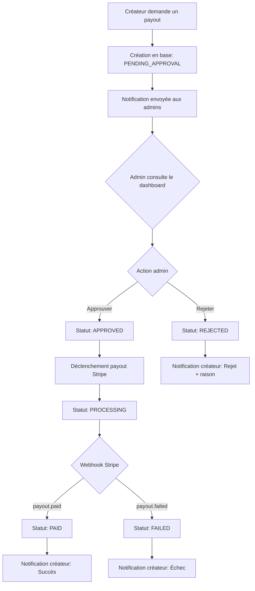
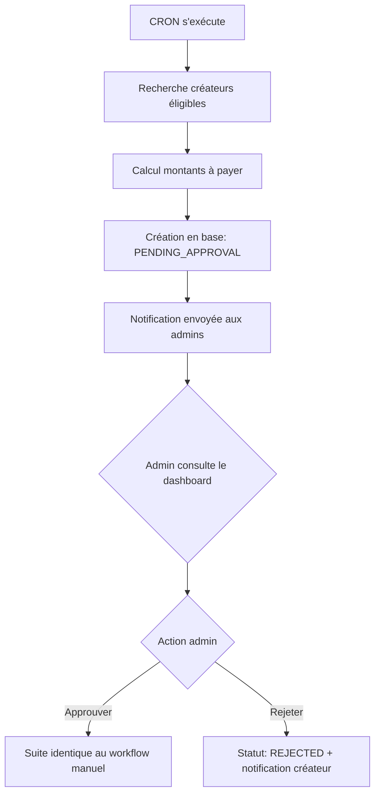

# 💰 Workflow de Validation Admin pour les Payouts

## 📋 Résumé

Ce document décrit l'implémentation complète du workflow de validation admin pour les payouts dans Call a Star. Tous les payouts (manuels et automatiques) passent maintenant par une approbation admin avant le déclenchement du transfert Stripe.

## ✅ Changements Effectués

### 1. Schéma Prisma (`prisma/schema.prisma`)

#### Ajout de nouveaux statuts dans l'enum `PayoutStatus`:
```prisma
enum PayoutStatus {
  PENDING           // Initial state, awaiting payment
  HELD              // Payment succeeded, funds held for 7 days
  READY             // Holding period passed, ready for transfer
  PENDING_APPROVAL  // ✅ NOUVEAU: Awaiting admin approval
  APPROVED          // ✅ NOUVEAU: Approved by admin, ready for Stripe processing
  REJECTED          // ✅ NOUVEAU: Rejected by admin
  PROCESSING        // Transfer in progress
  PAID              // Successfully transferred to creator
  FAILED            // Transfer failed
  CANCELLED         // Cancelled (refund/dispute)
}
```

#### Ajout de nouveaux champs dans le modèle `Payout`:
```prisma
model Payout {
  // ... champs existants ...
  rejectionReason String?      @db.Text // ✅ NOUVEAU: Reason for admin rejection
  approvedById    String?      // ✅ NOUVEAU: Admin user ID who approved/rejected
  approvedAt      DateTime?    // ✅ NOUVEAU: When approved/rejected
  // ... autres champs ...
}
```

### 2. Migration Prisma (`prisma/migrations/20251227090328_add_payout_approval_workflow/`)

Migration SQL créée pour ajouter:
- Les 3 nouveaux statuts à l'enum PayoutStatus
- Les 3 nouveaux champs au modèle Payout

### 3. Endpoint de Demande de Payout Créateur (`app/api/payouts/request/route.ts`)

#### Changements:
- ❌ **AVANT**: Statut initial `PROCESSING` + déclenchement immédiat du payout Stripe
- ✅ **APRÈS**: Statut initial `PENDING_APPROVAL` + enregistrement uniquement en base

#### Nouvelles fonctionnalités:
- Envoi de notification à tous les admins lors d'une nouvelle demande
- Message clair au créateur: "En attente d'approbation par l'administrateur"
- Aucun transfert Stripe déclenché

### 4. Nouveaux Endpoints Admin

#### 4.1 Approuver un Payout (`app/api/admin/payouts/[id]/approve/route.ts`)

**Endpoint**: `POST /api/admin/payouts/[id]/approve`

**Fonctionnalités**:
1. Vérifie que le payout existe et est en `PENDING_APPROVAL`
2. Change le statut à `APPROVED`
3. Déclenche le payout Stripe réel via `createConnectPayout()`
4. Enregistre le `stripePayoutId`
5. Met à jour le statut à `PROCESSING`
6. Envoie notification + email au créateur
7. Crée un audit log

**Sécurité**:
- Réservé aux admins uniquement
- En cas d'échec Stripe, le payout est remis en `PENDING_APPROVAL`

#### 4.2 Rejeter un Payout (`app/api/admin/payouts/[id]/reject/route.ts`)

**Endpoint**: `POST /api/admin/payouts/[id]/reject`

**Fonctionnalités**:
1. Vérifie que le payout existe et est en `PENDING_APPROVAL`
2. Change le statut à `REJECTED`
3. Enregistre la raison du rejet (obligatoire)
4. Envoie notification + email au créateur avec la raison
5. Crée un audit log

**Sécurité**:
- Réservé aux admins uniquement
- Raison du rejet obligatoire

### 5. Dashboard Admin (`app/dashboard/admin/payouts/page.tsx`)

#### Nouvelles fonctionnalités:

##### 5.1 Filtres enrichis:
- ✅ En attente d'approbation (PENDING_APPROVAL)
- ✅ Approuvé (APPROVED)
- ✅ Rejeté (REJECTED)
- En cours (PROCESSING)
- Payé (PAID)
- Échoué (FAILED)
- En attente (PENDING)

##### 5.2 Boutons d'action:
Pour les payouts avec statut `PENDING_APPROVAL`, affichage de 2 boutons:
- 🟢 **Approuver** (CheckCircle icon, vert)
- 🔴 **Rejeter** (XCircle icon, rouge)

##### 5.3 Modals de confirmation:

**Modal d'approbation**:
- Affiche les détails du payout (créateur, montant, date)
- Avertissement: "⚠️ Cette action déclenchera le transfert Stripe réel"
- Boutons: Annuler / Approuver

**Modal de rejet**:
- Affiche les détails du payout
- Champ textarea pour saisir la raison du rejet (obligatoire)
- Boutons: Annuler / Rejeter (désactivé si raison vide)

##### 5.4 Colonne mise à jour:
- Renommée: "Raison échec/rejet" (au lieu de "Raison échec")
- Affiche `failureReason` ou `rejectionReason` selon le cas

### 6. CRON Automatique (`app/api/cron/process-payouts/route.ts`)

#### Changements:
- ❌ **AVANT**: Crée un payout avec statut `PROCESSING` + déclenche Stripe immédiatement
- ✅ **APRÈS**: Crée un payout avec statut `PENDING_APPROVAL` + envoie notification aux admins

#### Impact:
Les payouts automatiques (quotidiens/hebdomadaires/mensuels) passent aussi par validation admin.

### 7. Webhooks Stripe (`app/api/payments/webhook/route.ts`)

#### Nouveaux webhooks ajoutés:

##### 7.1 `payout.canceled`:
- Met à jour le statut du payout à `CANCELLED`
- Crée un audit log
- Log l'événement

##### 7.2 `transfer.created`:
- Log l'événement pour traçabilité
- Enregistre les métadonnées (transferId, amount, destination)

##### 7.3 `transfer.succeeded`:
- Log l'événement pour traçabilité
- Enregistre les métadonnées avec statut "succeeded"

#### Webhooks existants maintenus:
- ✅ `payout.paid` → statut `PAID`
- ✅ `payout.failed` → statut `FAILED`
- ✅ `transfer.reversed` → revert payment status

## 🔄 Workflow Complet

### Workflow Manuel (Créateur)



### Workflow Automatique (CRON)



## 📊 Statuts et Transitions

| Statut | Description | Peut passer à |
|--------|-------------|---------------|
| `PENDING_APPROVAL` | En attente d'approbation admin | `APPROVED`, `REJECTED` |
| `APPROVED` | Approuvé par admin | `PROCESSING` |
| `REJECTED` | Rejeté par admin | - (final) |
| `PROCESSING` | Transfert Stripe en cours | `PAID`, `FAILED`, `CANCELLED` |
| `PAID` | Transféré avec succès | - (final) |
| `FAILED` | Échec du transfert | - (peut être retenté manuellement) |
| `CANCELLED` | Annulé par Stripe | - (final) |

## 🔐 Sécurité

### Contrôles d'accès:
- ✅ Endpoints admin réservés au rôle `ADMIN`
- ✅ Vérification du statut avant chaque action
- ✅ Validation des données (raison de rejet obligatoire)

### Audit:
- ✅ Enregistrement dans `PayoutAuditLog` pour chaque action
- ✅ Traçabilité complète: qui, quoi, quand
- ✅ Métadonnées JSON pour contexte détaillé

### Notifications:
- ✅ Admins notifiés à chaque nouvelle demande
- ✅ Créateurs notifiés du résultat (approuvé/rejeté)
- ✅ Emails envoyés pour les événements importants

## 📝 Notes d'implémentation

### Points d'attention:
1. **Rétrocompatibilité**: Les anciens payouts avec statut `PROCESSING` continuent de fonctionner normalement
2. **Conversion de devises**: Le système gère correctement les conversions EUR ↔ CHF/USD/etc.
3. **Gestion d'erreurs**: Si le payout Stripe échoue après approbation, le statut reste en `PENDING_APPROVAL` pour permettre de retenter

### Améliorations futures possibles:
- [ ] Filtre "Demandes en attente" dans le dashboard admin
- [ ] Notification par email aux admins (en plus des notifications in-app)
- [ ] Historique des approbations/rejets avec raisons
- [ ] Dashboard créateur montrant l'état de ses demandes
- [ ] Possibilité pour le créateur d'annuler une demande en attente

## 🧪 Tests Recommandés

### Test manuel du workflow:
1. ✅ Créateur demande un payout → vérifier statut `PENDING_APPROVAL`
2. ✅ Admin voit la demande dans le dashboard
3. ✅ Admin approuve → vérifier déclenchement Stripe + statut `PROCESSING`
4. ✅ Webhook `payout.paid` → vérifier statut `PAID`
5. ✅ Admin rejette → vérifier statut `REJECTED` + notification créateur
6. ✅ CRON s'exécute → vérifier création `PENDING_APPROVAL`

### Test des cas d'erreur:
1. ✅ Stripe rejette le payout après approbation → vérifier revert à `PENDING_APPROVAL`
2. ✅ Admin essaie d'approuver un payout déjà approuvé → vérifier erreur 400
3. ✅ Non-admin essaie d'accéder aux endpoints → vérifier erreur 401

## 📦 Fichiers Modifiés

### Fichiers créés:
- `app/api/admin/payouts/[id]/approve/route.ts` (269 lignes)
- `app/api/admin/payouts/[id]/reject/route.ts` (186 lignes)
- `prisma/migrations/20251227090328_add_payout_approval_workflow/migration.sql`

### Fichiers modifiés:
- `prisma/schema.prisma` (+6 lignes)
- `app/api/payouts/request/route.ts` (~150 lignes modifiées)
- `app/dashboard/admin/payouts/page.tsx` (+230 lignes)
- `app/api/cron/process-payouts/route.ts` (~80 lignes modifiées)
- `app/api/payments/webhook/route.ts` (+150 lignes)

### Total:
- **8 fichiers** modifiés/créés
- **~977 lignes** ajoutées
- **~256 lignes** supprimées

## 🎯 Objectifs Atteints

✅ **Sécurité**: Tous les payouts passent par validation admin  
✅ **Traçabilité**: Audit complet de toutes les actions  
✅ **UX Admin**: Interface claire avec boutons d'action  
✅ **UX Créateur**: Notifications claires à chaque étape  
✅ **Webhooks**: Gestion complète des événements Stripe  
✅ **CRON**: Payouts automatiques aussi validés  
✅ **Documentation**: README complet avec schémas  

## 🚀 Déploiement

### Étapes de déploiement:

1. **Appliquer la migration Prisma**:
```bash
npx prisma migrate deploy
```

2. **Vérifier les variables d'environnement**:
```bash
# Déjà configurées (pas de nouvelles variables)
DATABASE_URL=...
STRIPE_SECRET_KEY=...
STRIPE_WEBHOOK_SECRET=...
```

3. **Redémarrer l'application**:
```bash
npm run build
npm run start
```

4. **Configurer les webhooks Stripe** (si pas déjà fait):
   - Ajouter `payout.canceled`
   - Ajouter `transfer.created`
   - Ajouter `transfer.succeeded`

## 📞 Support

En cas de problème:
- Vérifier les logs Prisma pour les erreurs de migration
- Vérifier les logs Stripe pour les webhooks
- Consulter `PayoutAuditLog` pour l'historique des actions

---

**Version**: 1.0.0  
**Date**: 27 décembre 2024  
**Auteur**: DeepAgent  
**Commit**: `7a79899` - feat: Implémenter workflow de validation admin pour les payouts
